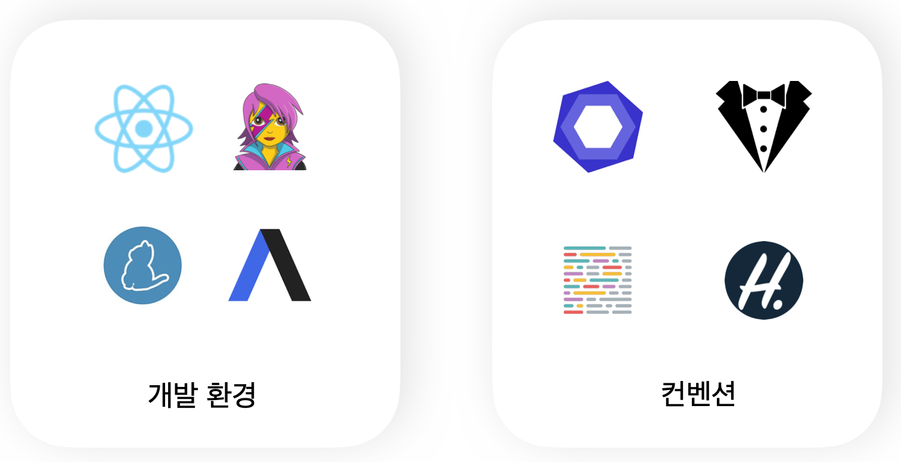
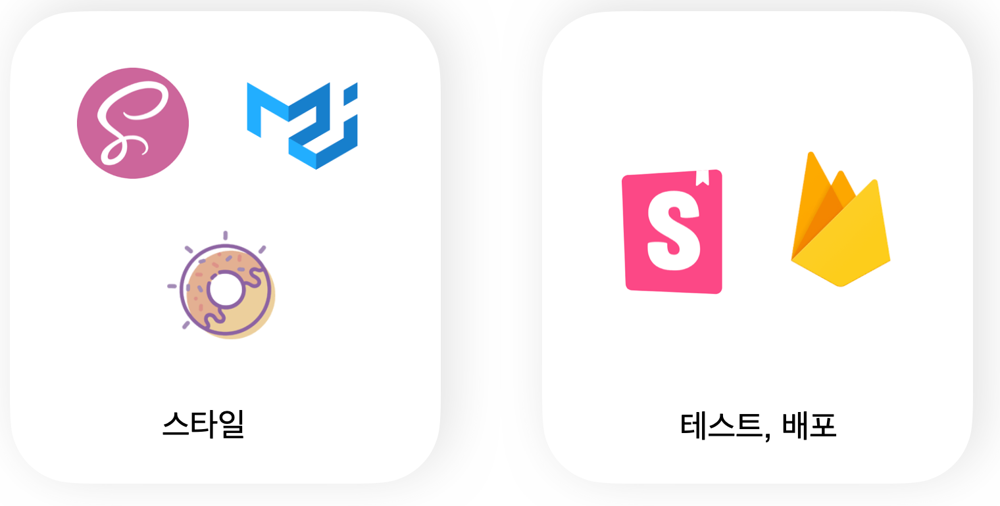

## 🧇 와플카드 프로젝트 소개 🗂


<br />

### 🧇 와플카드는?

>  해시태그와 카드를 활용한 익명의 관심사 소통 서비스

<br />

##### Background

사람들이 대화를 편하게 진행할 수 있는 요소가 들어간 SNS가 필요하다.

- 익명성 : 익명으로 소통을 나누고 싶은 욕구가 있다.
- 흥미성 : 재밌게 소통하고 싶다.
- 캐주얼함 : 부담없이 친해질 수 있는 장치가 필요하다.
- 유사성 : 나의 관심사로 얘기를 나누고 싶다.
- 접근성 : 남녀노소 사용하기 쉬운 UX/UI로 누구나 대화를 온라인에서 나눌 수 있는 기회가 필요하다.


##### **How it works**

- 타깃 고객 및 사이즈 : KDT 프론트엔드반 프롱이들 / 약 60명(전체 수용인원)
  - 소속이 있는 20대 중후반. 정예 멤버들도 사용 가능.
- 어디서 : 사용자들의 로컬 PC로 "와플카드" 웹 사이트 접속
- 무엇을 만들고 싶은가

1. 대화 카드를 만들고 싶은 유저는 카드 섹션을 만들어 대화방을 오픈한다.
2. 자신이 대화하고 싶은 키워드를 해시태그로 적어 카드를 생성한다
3. 유저 당 만들 수 있는 카드는 1개, 해시태그를 변경한다.
4. 웹 사이트에 접속하면 유저들이 만든 카드가 띄워지고, 채팅방에 참여하고 싶은 유저들은 '자신이 원하는, 흥미로운 주제가 있는, 호기심이 생기는' 카드를 클릭해 대화에 참여한다.
5. 채팅방은 비동기적인 댓글 방식으로 구현


##### 기대효과

프롱이들 사이에서 "익명성"을 활용하여

1. **익명성을 갖고 속시원하게 터놓으**며 소통이 가능하다. (나쁜기억지우개방, 자랑방, 드립방, 선택장애방과 같은 다양한 컨셉의 방)
2. **다양한 관심사를 말하면서 재미요소**가 있다고 기대한다. (이런 익명성과 자유주제 컨셉방이라는 성질과 해쉬태그와 카드라는 컨셉)

<br />

### 🗓 프로젝트 기간

> 21.10.15 ~ 21.11.05

<br />

### 🚀 배포링크

https://waffle-card.web.app
<br />


### 👨‍👩‍👧‍👦 팀원소개

| 이름   | 깃허브                                    |
| ------ | ----------------------------------------- |
| 김지은 | [oranjik](https://github.com/oranjik)     |
| 나은찬 | [naeunchan](https://github.com/naeunchan) |
| 양윤   | [yyoooon](https://github.com/yyoooon)     |
| 정윤호 | [younoah](https://github.com/younoah)     |

<br />

### 🧑🏻‍💻 기술스택





<br />

### 📝 서비스 흐름도


<br />

### 🎨 페이지 및 기능

#### 회원가입

https://user-images.githubusercontent.com/41064875/140710978-c406941a-5456-4fa8-80a0-07840d97899c.mp4

<br />

#### 로그인

https://user-images.githubusercontent.com/41064875/140710943-77b991e7-48cd-4d46-8ee9-7075029c64ad.mp4

<br />

#### 마이페이지

https://user-images.githubusercontent.com/41064875/140710962-c479dfa4-7da3-4dd3-b5e3-5adf846f7a47.mp4

<br />

#### 카드생성 및 수정

https://user-images.githubusercontent.com/41064875/140710973-d8ba5e8a-aa33-4e95-b86d-143c6ed68630.mp4

<br />

#### Home

https://user-images.githubusercontent.com/41064875/140710976-8cfa9f25-9ddd-4325-a1f1-eb44303573fa.mp4

<br />

#### 채팅카드

https://user-images.githubusercontent.com/41064875/140710972-8f337fba-ae07-42d9-a386-b68319d6ea27.mp4

<br />

#### 반응형

https://user-images.githubusercontent.com/41064875/140710966-f3907b0a-226c-4825-ab86-495e0fb1dcac.mp4


<br />

### 🌳 프로젝트 구조

```shell
src
├── App.jsx
├── apis
│   └── index.jsx
├── components
│   ├── base
│   │   ├── BackButton
│   │   │   └── index.jsx
│   │   ├── Button
│   │   │   └── index.jsx
│   │   ├── Card
│   │   │   ├── Empty.jsx
│   │   │   └── index.jsx
│   │   ├── ColorPalette
│   │   │   ├── ColorItem.jsx
│   │   │   └── index.jsx
│   │   ├── Icons
│   │   │   ├── Add.jsx
│   │   │   ├── ArrowBack.jsx
│   │   │   ├── ArrowFront.jsx
│   │   │   ├── Bookmark.jsx
│   │   │   ├── Delete.jsx
│   │   │   ├── Edit.jsx
│   │   │   ├── Like.jsx
│   │   │   ├── Person.jsx
│   │   │   ├── Send.jsx
│   │   │   └── index.jsx
│   │   ├── Input
│   │   │   └── index.jsx
│   │   ├── Modal
│   │   │   └── index.jsx
│   │   ├── Portal
│   │   │   └── index.jsx
│   │   ├── ScrollGuide
│   │   │   ├── index.jsx
│   │   │   └── scroll_guide_icon.png
│   │   ├── Spacer
│   │   │   └── index.jsx
│   │   ├── Spinner
│   │   │   └── index.jsx
│   │   └── Text
│   │       └── index.jsx
│   ├── domain
│   │   ├── CardEditModal
│   │   │   ├── EmojiPickerActiveButton.jsx
│   │   │   ├── HashTagInput.jsx
│   │   │   └── index.jsx
│   │   ├── CardsContainer
│   │   │   └── index.jsx
│   │   ├── ChattingCard
│   │   │   ├── Bookmark.jsx
│   │   │   ├── Header.jsx
│   │   │   ├── Like.jsx
│   │   │   ├── Message.jsx
│   │   │   └── index.jsx
│   │   ├── EditBox
│   │   │   └── index.jsx
│   │   ├── Header
│   │   │   ├── index.jsx
│   │   │   └── logo.png
│   │   ├── NameChangeModal
│   │   │   └── index.jsx
│   │   ├── PasswordChangeModal
│   │   │   └── index.jsx
│   │   ├── Tab
│   │   │   ├── TabItem.jsx
│   │   │   └── index.jsx
│   │   ├── ToggleBox
│   │   │   └── index.jsx
│   │   └── WaffleCard
│   │       └── index.jsx
│   ├── index.js
│   └── template
│       └── index.jsx
├── contexts
│   ├── UserProvider.jsx
│   └── index.jsx
├── hooks
│   ├── index.jsx
│   ├── useAuthUser.jsx
│   ├── useClickAway.jsx
│   ├── useForm.jsx
│   ├── useHover.jsx
│   ├── useSessionStorage.jsx
│   └── useToggle.jsx
├── index.css
├── index.jsx
├── pages
│   ├── GuidePage
│   │   └── index.jsx
│   ├── HomePage
│   │   └── index.jsx
│   ├── LoginPage
│   │   └── index.jsx
│   ├── MyPage
│   │   └── index.jsx
│   ├── NotFoundPage
│   │   └── index.jsx
│   ├── SignUpPage
│   │   └── index.jsx
│   └── index.jsx
├── stories
│   ├── components
│   │   ├── base
│   │   │   ├── BackButton.stories.jsx
│   │   │   ├── Button.stories.jsx
│   │   │   ├── Card.stories.jsx
│   │   │   ├── ColorPalette.stories.jsx
│   │   │   ├── Icons.stories.jsx
│   │   │   ├── Input.stories.jsx
│   │   │   ├── Modal.stories.jsx
│   │   │   ├── ScrollGuide.stories.jsx
│   │   │   ├── Spacer.stories.jsx
│   │   │   ├── Spinner.stories.jsx
│   │   │   └── Text.stories.jsx
│   │   └── domain
│   │       ├── CardEditModal.stories.jsx
│   │       ├── ChattingCard.stories.jsx
│   │       ├── EditBox.stories.jsx
│   │       ├── NameChangeModal.stories.jsx
│   │       ├── PasswordChangeModal.stories.js
│   │       ├── Tab.stories.jsx
│   │       ├── ToggleBox.stories.jsx
│   │       └── WaffleCard.stories.jsx
│   ├── hooks
│   │   └── useHover.stories.jsx
│   └── pages
│       ├── HomePage.stories.jsx
│       ├── LoginPage.stories.jsx
│       ├── MyPage.stories.jsx
│       ├── NotFoundPage.stories.jsx
│       └── SignUpPage.stories.jsx
├── styles
│   ├── common.jsx
│   ├── global-styles.jsx
│   └── index.js
├── utils
│   └── index.jsx
└── validators
    └── index.jsx
```

