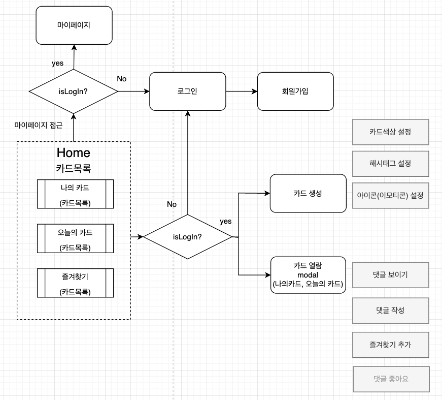

## 🧇 와플카드 프로젝트 소개 🗂

 

### 🧇 와플카드는?

>  해시태그와 카드를 활용한 익명의 관심사 소통 서비스

 

### 프로젝트 기획 배경

사람들이 대화를 편하게 진행할 수 있는 요소가 들어간 SNS가 필요하다.

- 익명성 : 익명으로 소통을 나누고 싶은 욕구가 있다.
- 흥미성 : 재밌게 소통하고 싶다.
- 캐주얼함 : 부담없이 친해질 수 있는 장치가 필요하다.
- 유사성 : 나의 관심사로 얘기를 나누고 싶다.
- 접근성 : 남녀노소 사용하기 쉬운 UX/UI로 누구나 대화를 온라인에서 나눌 수 있는 기회가 필요하다.

 

### 프로젝트 상세 소개

💡 **핵심 기능**

1. 자신이 대화하고 싶은 키워드를 해시태그로 작성하고 이모지, 카드컬러를 선택하여 나만의 와플카드를 생성합니다.
2. 유저 당 만들 수 있는 카드는 1개이며 와플카드 내용은 수정이 가능합니다.
3. 홈 화면에 유저들이 만든 카드가 띄워지고, 채팅방에 참여하고 싶은 유저들은 카드를 클릭하여 대화에 참여합니다.

 

🙋🏻‍♂️ **타겟 유저**

- 프로그래머스 KDT 웹 프론트엔드반 프롱이들 / 약 60명(전체 수용인원)
- 서비스 확장시 소속이 있는 20대 중후반

 

📍 **기대 효과**

프롱이들 사이에서 "익명성"을 활용하여

1. **익명성을 갖고 속시원하게 터놓으**며 소통이 가능합니다. (나쁜기억지우개방, 자랑방, 드립방, 선택장애방과 같은 다양한 컨셉의 방)
2. **다양한 관심사를 말하면서 재미요소**가 있다고 기대합니다. (이런 익명성과 자유주제 컨셉방이라는 성질과 해쉬태그와 카드라는 컨셉)

 

### 🗓 개발 기간 & 일정

- 1차 : 2021.10.18 ~ 2021.11.08
- 리팩토링 : 2021.02.01 ~ 진행중

 

### 🚀 배포링크

https://waffle-card.com/

 

### 🧑🏻‍💻 기술스택

- `Javascript`, `Typescript`, `React`
- `Context`, `Recoil`,  `Axios`
- `Storybook`, `Emotion`, `Mui`
- `ESLint`, `Prettier`, `Netlify`

 

### 📝 서비스 흐름도

 

### 🎨 페이지 및 기능

#### 회원가입

https://user-images.githubusercontent.com/41064875/140710978-c406941a-5456-4fa8-80a0-07840d97899c.mp4

 

#### 로그인

https://user-images.githubusercontent.com/41064875/140710943-77b991e7-48cd-4d46-8ee9-7075029c64ad.mp4

 

#### 마이페이지

https://user-images.githubusercontent.com/41064875/140710962-c479dfa4-7da3-4dd3-b5e3-5adf846f7a47.mp4

 

#### 카드생성 및 수정

https://user-images.githubusercontent.com/41064875/140710973-d8ba5e8a-aa33-4e95-b86d-143c6ed68630.mp4

 

#### Home

https://user-images.githubusercontent.com/41064875/140710976-8cfa9f25-9ddd-4325-a1f1-eb44303573fa.mp4

 

#### 채팅카드

https://user-images.githubusercontent.com/41064875/140710972-8f337fba-ae07-42d9-a386-b68319d6ea27.mp4

 

#### 반응형

https://user-images.githubusercontent.com/41064875/140710966-f3907b0a-226c-4825-ab86-495e0fb1dcac.mp4
